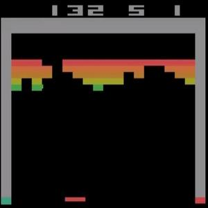

[video demo](https://youtu.be/o21mddZtE5Y)

Reproduce the following reinforcement learning papers:

+ Nature-DQN in:
[Human-level Control Through Deep Reinforcement Learning](http://www.nature.com/nature/journal/v518/n7540/full/nature14236.html)

+ Double-DQN in:
[Deep Reinforcement Learning with Double Q-learning](http://arxiv.org/abs/1509.06461)

+ Dueling-DQN in: [Dueling Network Architectures for Deep Reinforcement Learning](https://arxiv.org/abs/1511.06581)

+ A3C in [Asynchronous Methods for Deep Reinforcement Learning](http://arxiv.org/abs/1602.01783). (I
used a modified version where each batch contains transitions from different simulators, which I called "Batch-A3C".)

Claimed performance in the paper can be reproduced, on several games I've tested with.


DQN typically took 2 days of training to reach a score of 400 on breakout game.
My Batch-A3C implementation only took <2 hours.
Both were trained on one GPU with an extra GPU for simulation.

The x-axis is the number of iterations, not wall time.
Iteration speed on Tesla M40 is about 9.7it/s for B-A3C.
D-DQN is faster at the beginning but will converge to 12it/s due of exploration annealing.

## How to use

Download [atari roms](https://github.com/openai/atari-py/tree/master/atari_py/atari_roms) to
`$TENSORPACK_DATASET/atari_rom` (defaults to tensorpack/dataflow/dataset/atari_rom).

To train:
```
./DQN.py --rom breakout.bin --gpu 0
```

To visualize the agent:
```
./DQN.py --rom breakout.bin --task play --load trained.model
```

A3C code and models for Atari games in OpenAI Gym are released in [examples/OpenAIGym](../OpenAIGym)
