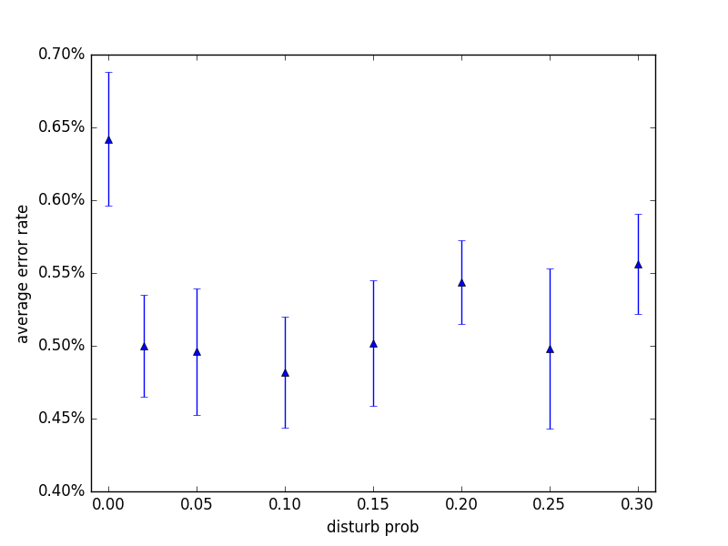
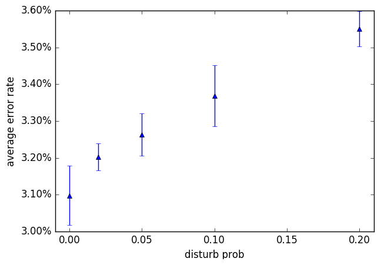

## DisturbLabel

I ran into the paper [DisturbLabel: Regularizing CNN on the Loss Layer](https://arxiv.org/abs/1605.00055) on CVPR16,
which basically said that noisy data gives you better performance.
As many, I didn't believe the method and the results.

This is a simple mnist training script with DisturbLabel. It uses the simple architecture in the paper, and
hyperparameters in my original [mnist example](../mnist-convnet.py).
The results surprised me, clean labels give the worst accuracy:

Experiements were repeated 15 times for p=0, 10 times for p=0.02 & 0.05, and 5 times for other values
of p. All experiements run for 100 epochs, with lr decay, which are enough for them to converge.

I suppose the disturb method works as a random noise that could prevent SGD from getting stuck, if
training data are too easy or too few.
It didn't work for harder problems such as SVHN:

The SVHN experiements used the model & hyperparemeters as my original [svhn example](../svhn-digit-convnet.py).
Experiements were all repeated 10 times to get the error bar.

And I don't believe it will work for ImageNet either.
