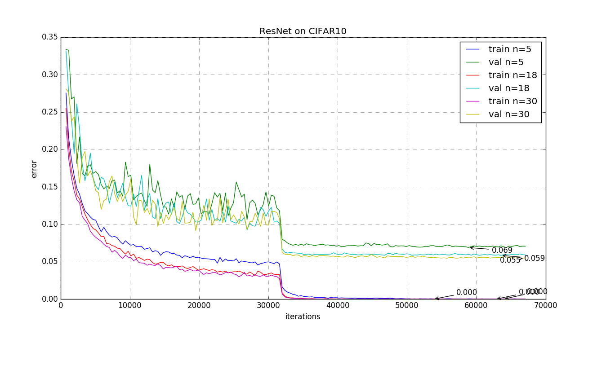

## imagenet-resnet.py

Training code of pre-activation ResNet on ImageNet. It follows the setup in
[fb.resnet.torch](https://github.com/facebook/fb.resnet.torch) and gets similar performance (with much fewer lines of code).
More results to come.

| Model              | Top 5 Error | Top 1 Error |
|:-------------------|-------------|------------:|
| ResNet 18          |      10.67% |      29.50% |
| ResNet 50          |      7.13%  |      24.12% |

## load-resnet.py

A script to convert and run ResNet{50,101,152} caffe models trained on ImageNet [released by Kaiming](https://github.com/KaimingHe/deep-residual-networks).

Example usage:
```bash
# convert caffe model to npy format
python -m tensorpack.utils.loadcaffe PATH/TO/{ResNet-101-deploy.prototxt,ResNet-101-model.caffemodel} ResNet101.npy
# run on an image
./load-resnet.py --load ResNet-101.npy --input cat.jpg --depth 101
```

The converted models are verified on ILSVRC12 validation set.
The per-pixel mean used here is slightly different from the original.

| Model              | Top 5 Error | Top 1 Error |
|:-------------------|-------------|------------:|
| ResNet 50          |      7.89%  |      25.03% |
| ResNet 101         |      7.16%  |      23.74% |
| ResNet 152         |      6.81%  |      23.28% |

## cifar10-resnet.py

Reproduce pre-activation ResNet on CIFAR10.

The train error shown here is a moving average of the error rate of each batch in training.
The validation error here is computed on test set.



Download model:
[Cifar10 ResNet-110 (n=18)](https://drive.google.com/open?id=0B9IPQTvr2BBkTXBlZmh1cmlnQ0k)

Also see an implementation of [DenseNet](https://github.com/YixuanLi/densenet-tensorflow) from [Densely Connected Convolutional Networks](https://arxiv.org/abs/1608.06993).
